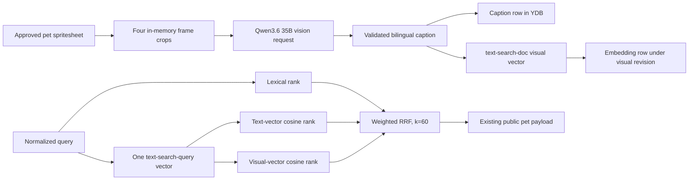

# Codex Pets Vision-Assisted Hybrid Search Design

**Status:** Awaiting review of the written specification

**Date:** 2026-07-22

**Scope:** Internal vision captions and a separately weighted visual-semantic rank for all approved pets

## Context

Codex Pets already has an implemented text-hybrid search path on branch `codex/hybrid-pet-search`:

- lexical ranking over the complete approved catalog;
- Yandex AI Studio `text-search-query` and `text-search-doc` embeddings;
- exact cosine search in YDB;
- RRF fusion with exact slug/display-name precedence;
- lexical fallback when the semantic path is unavailable;
- one internal `searchApprovedPets` entry point for the homepage, JSON, TOON, MCP, and WebMCP surfaces.

The calibrated text revision `yandex-text-search-2026-07` has 256 dimensions and a semantic threshold of `0.31`. Its measured baseline is exact-name MRR@5 `1.0`, lexical nDCG@5 `0.4923`, text-hybrid nDCG@5 `0.6289`, a `27.7%` lift, negative-fixture safety, and uncached p95 below one second. Production has not been switched to this candidate yet.

Text metadata is often too sparse to describe visual properties. A query such as `sexy` can therefore miss visually relevant pets even when their sprites clearly convey the concept. This design adds offline vision-generated metadata and a separate visual-semantic rank without adding query-time vision or changing public payloads.

## Goals

- Search the whole approved catalog. There is no hidden `adult-character`, mature-audience, or similar policy filter.
- Preserve explicit user filters such as `kind`, `tags`, and `author`.
- Generate internal visual descriptions from four deterministic sprite frames.
- Store strict bilingual captions with reproducible provenance.
- Keep text and visual document vectors as separate revisions.
- Reuse one query embedding for both text and visual cosine searches.
- Combine lexical, text-semantic, and visual-semantic ranks with weighted RRF.
- Preserve exact slug/display-name precedence and lexical/text fallbacks.
- Keep captions, source metadata, and visual diagnostics out of every public contract.
- Roll out additively through `off`, `shadow`, and `hybrid` modes with measurable non-regression gates.

## Non-goals

- No Qdrant, approximate-nearest-neighbor index, or image embedding model in v1.
- No query-time image generation or vision request.
- No special rule, synonym list, boost, or policy branch for `sexy`.
- No public caption field in HTML, JSON, TOON, OpenAPI, MCP, or WebMCP.
- No generated frame, raw image, or provider response persisted outside the caption record.
- No durable queue, cron job, or new npm dependency.
- No nginx, YDB topology, YDB authentication, port, or network changes.
- No automatic table creation from application startup or request handlers.

## High-level data flow



Vision is strictly an indexing-time operation. A search request sends only the normalized text query to the embedding endpoint and never sends an image to the provider.

## Deterministic frame extraction

### Frame policy

The immutable v1 frame-policy identifier is:

```text
pet-vision-central-frames-v1
```

The policy extracts the following zero-based row/frame pairs:

| State | Row | Frame count | Selected frame |
|---|---:|---:|---:|
| `idle` | 0 | 6 | 3 |
| `running-right` | 1 | 8 | 4 |
| `waving` | 3 | 4 | 2 |
| `review` | 8 | 6 | 3 |

The selected index is `floor(frameCount / 2)`. The explicit table, rather than a runtime lookup alone, is part of the revision contract.

### Extraction behavior

- Read the approved pet's spritesheet through the existing YDB asset repository.
- Infer and validate sprite version from image dimensions with the existing `PET_SHEETS` contract.
- Reject an invalid atlas before any provider call.
- Crop each `192 x 208` cell with Sharp and encode it as a lossless PNG.
- Preserve transparency and original nearest-neighbor pixels; do not resize or enhance the crop.
- Keep the source spritesheet, four crops, Base64 strings, and request body in memory only.
- Send the four images as `data:image/png;base64,...` URLs in the fixed order shown above.
- Do not send the pet name, slug, kind, description, tags, owner, URLs, or any previous caption to the vision model.

State labels may appear in the fixed instruction so the model knows the image order. They are frame-policy metadata, not catalog metadata.

## Vision provider contract

### Endpoint and authentication

Use built-in `fetch` against the OpenAI-compatible endpoint:

```text
POST https://ai.api.cloud.yandex.net/v1/chat/completions
```

Headers:

```text
Authorization: Api-Key API_KEY_FROM_SECRET_FILE
OpenAI-Project: YANDEX_AI_STUDIO_FOLDER_ID
Content-Type: application/json
```

The model URI is stable and revision-specific:

```text
gpt://YANDEX_AI_STUDIO_FOLDER_ID/qwen3.6-35b-a3b
```

The existing service account role `ai.languageModels.user` and API-key scope `yc.ai.foundationModels.execute` are sufficient. The API key remains in a mode-`600` secret file and is never copied into client code or logs.

The application-level caption revision is:

```text
yandex-qwen3.6-35b-a3b-pet-caption-2026-07-v1
```

The revision freezes the model URI, frame policy, prompt, response schema, normalization rules, and canonical caption-text format. Any change to one of those inputs requires a new caption revision and a fresh backfill.

### Configuration

The provider reuses `YANDEX_AI_STUDIO_FOLDER_ID` and `YANDEX_AI_STUDIO_API_KEY_FILE`. Add these server-only settings:

| Variable | Default or required value | Purpose |
|---|---|---|
| `PET_SEARCH_VISUAL_MODE` | `off` | Independent visual rollout switch |
| `PET_SEARCH_VISION_CAPTION_REVISION` | `yandex-qwen3.6-35b-a3b-pet-caption-2026-07-v1` | Selects the code-registered model, prompt, schema, and frame policy |
| `PET_SEARCH_VISUAL_MODEL_REVISION` | `yandex-text-search-2026-07-pet-vision-v1` | Selects visual vectors and their calibrated profile |
| `PET_SEARCH_VISION_TIMEOUT_MS` | `30000` | Offline vision request timeout, clamped to 1–60 seconds |

Unsupported or incomplete vision configuration disables visual ranking with an internal configuration fallback reason. It must not affect text-hybrid output. The model URI, prompt, and schema are selected from the caption-revision registry rather than accepted as arbitrary environment text.

### Request settings

- `temperature: 0`
- `stream: false`
- `max_tokens: 900`
- `response_format.type: "json_schema"`
- `response_format.json_schema.name: "pet_visual_caption_v1"`
- `response_format.json_schema.strict: true`
- `response_format.json_schema.schema`: the provider response schema below
- request timeout: 30 seconds
- at most one concurrent vision request per process
- at most ten vision request starts per minute per process, including retries, evenly paced
- at most one retry for HTTP `429` or `5xx`, honoring `Retry-After` up to ten seconds
- no retry for authentication, validation, refusal, malformed response, or other `4xx` errors

The backfill stops with a non-zero status after an unrecoverable provider or persistence error and preserves already committed rows. Re-running it resumes idempotently. An approval-triggered best-effort refresh records only an aggregate failure reason and does not retry outside the bounds above.

### Fixed prompt

System instruction:

```text
You create internal search metadata for an animated software companion from four sprite frames. Describe only visible evidence. Do not infer or use identity, a character name, existing catalog metadata, hidden backstory, protected attributes, or an exact age. Use neutral language when uncertain. Describe visible subject type, appearance, clothing or accessories, art style, mood or pose, dominant colors, and concrete search concepts. Apply the same descriptive standard to every visual style; do not apply catalog-category or audience filters. English and Russian fields must be semantic equivalents. Output only JSON matching the supplied schema.
```

User instruction:

```text
The four images are ordered as idle, running-right, waving, and review. Produce the bilingual visual-search caption.
```

The prompt does not mention `sexy` or any other evaluation query.

## Caption schema and canonicalization

### Provider response schema

The provider must return exactly this shape; every object has `additionalProperties: false`:

```json
{
  "type": "object",
  "additionalProperties": false,
  "required": [
    "subject",
    "appearance",
    "clothing",
    "style",
    "mood",
    "colors",
    "search_terms_en",
    "search_terms_ru"
  ],
  "properties": {
    "subject": { "$ref": "#/$defs/bilingualRequired" },
    "appearance": { "$ref": "#/$defs/bilingualRequired" },
    "clothing": { "$ref": "#/$defs/bilingualOptional" },
    "style": { "$ref": "#/$defs/bilingualRequired" },
    "mood": { "$ref": "#/$defs/bilingualRequired" },
    "colors": {
      "type": "object",
      "additionalProperties": false,
      "required": ["en", "ru"],
      "properties": {
        "en": { "$ref": "#/$defs/termList" },
        "ru": { "$ref": "#/$defs/termList" }
      }
    },
    "search_terms_en": { "$ref": "#/$defs/searchTermList" },
    "search_terms_ru": { "$ref": "#/$defs/searchTermList" }
  },
  "$defs": {
    "bilingualRequired": {
      "type": "object",
      "additionalProperties": false,
      "required": ["en", "ru"],
      "properties": {
        "en": { "type": "string", "minLength": 1, "maxLength": 320 },
        "ru": { "type": "string", "minLength": 1, "maxLength": 320 }
      }
    },
    "bilingualOptional": {
      "type": "object",
      "additionalProperties": false,
      "required": ["en", "ru"],
      "properties": {
        "en": { "type": "string", "maxLength": 240 },
        "ru": { "type": "string", "maxLength": 240 }
      }
    },
    "termList": {
      "type": "array",
      "minItems": 1,
      "maxItems": 8,
      "items": { "type": "string", "minLength": 1, "maxLength": 40 }
    },
    "searchTermList": {
      "type": "array",
      "minItems": 3,
      "maxItems": 20,
      "items": { "type": "string", "minLength": 1, "maxLength": 60 }
    }
  }
}
```

Application validation remains mandatory even when the provider claims strict structured output. It parses exactly one JSON object, rejects unknown/missing fields and wrong types, and applies Unicode NFKC, whitespace collapse, trimming, length limits, empty-value rules, and case-insensitive stable deduplication of arrays.

### Stored internal JSON

`caption_json` stores an application-controlled envelope. The provider creates only the `caption` member; the application adds provenance after validation:

```json
{
  "schemaVersion": 1,
  "source": {
    "assetId": "asset identifier parsed from the approved internal URL",
    "spritesheetSha256": "lowercase hexadecimal SHA-256"
  },
  "caption": {
    "subject": { "en": "...", "ru": "..." },
    "appearance": { "en": "...", "ru": "..." },
    "clothing": { "en": "...", "ru": "..." },
    "style": { "en": "...", "ru": "..." },
    "mood": { "en": "...", "ru": "..." },
    "colors": { "en": ["..."], "ru": ["..."] },
    "search_terms_en": ["..."],
    "search_terms_ru": ["..."]
  }
}
```

The envelope is internal and is never serialized into a public pet DTO.

### Canonical caption text

`caption_text` is deterministic UTF-8 text built from normalized values in this exact field order:

```text
subject_en: NORMALIZED_SUBJECT_EN
subject_ru: NORMALIZED_SUBJECT_RU
appearance_en: NORMALIZED_APPEARANCE_EN
appearance_ru: NORMALIZED_APPEARANCE_RU
clothing_en: NORMALIZED_CLOTHING_EN
clothing_ru: NORMALIZED_CLOTHING_RU
style_en: NORMALIZED_STYLE_EN
style_ru: NORMALIZED_STYLE_RU
mood_en: NORMALIZED_MOOD_EN
mood_ru: NORMALIZED_MOOD_RU
colors_en: COMMA_SEPARATED_COLORS_EN
colors_ru: COMMA_SEPARATED_COLORS_RU
search_terms_en: COMMA_SEPARATED_SEARCH_TERMS_EN
search_terms_ru: COMMA_SEPARATED_SEARCH_TERMS_RU
```

No name, slug, description, tag, owner, or source identifier is appended to this text. This keeps the visual vector independent from the existing text vector.

## Revisions and source hashes

All hashes are lowercase hexadecimal SHA-256 over length-prefixed UTF-8 or binary fields, so concatenation cannot be ambiguous.

### Caption source hash

The caption `source_hash` covers, in order:

1. caption revision;
2. exact provider model URI;
3. exact system and user prompts;
4. canonical JSON Schema;
5. frame-policy identifier and ordered row/frame table;
6. approved asset identifier;
7. SHA-256 of the raw spritesheet bytes.

This makes a change to the sprite, model, frame selection, prompt, schema, or normalization contract stale by construction.

### Visual embedding source hash

The visual embedding row uses:

```text
SHA-256(
  visual embedding revision,
  caption revision,
  caption source_hash,
  canonical caption_text
)
```

The visual embedding revision is:

```text
yandex-text-search-2026-07-pet-vision-v1
```

It uses the same 256-dimensional `text-search-doc` model as the current text revision, but the distinct revision prevents text and visual document vectors from overwriting or masquerading as each other.

### Request-time freshness

A visual match is eligible only when all of the following hold:

- the pet is currently in the filtered approved candidate set;
- the caption row has the configured caption revision;
- its stored source asset ID equals the asset ID in the current approved pet URL;
- the vector row has the configured visual revision and 256 dimensions;
- the vector source hash equals the value recomputed from the caption row;
- the cosine score meets the revision-bound visual threshold.

The search request does not read spritesheet blobs. Asset IDs are immutable in the current storage contract; byte-level freshness is established during approval refresh and backfill. If assets ever become mutable under one asset ID, the asset table must gain an authoritative checksum before this invariant is changed.

## YDB persistence

Add migration:

```text
ydb/migrations/20260722_002_add_pet_search_captions.mjs
```

Add this table to `ydb/schema.yql`:

```sql
CREATE TABLE codex_pet_search_captions (
  caption_revision Utf8 NOT NULL,
  pet_slug Utf8 NOT NULL,
  source_hash Utf8 NOT NULL,
  caption_json Utf8 NOT NULL,
  caption_text Utf8 NOT NULL,
  updated_at Utf8 NOT NULL,
  PRIMARY KEY (caption_revision, pet_slug)
);
```

The existing table remains unchanged:

```text
codex_pet_search_embeddings(model_revision, pet_slug, source_hash, dimensions, embedding, updated_at)
```

Text and visual rows are distinguished by `model_revision`. The captions repository is internal and supports metadata read, full-row read, upsert, batch lookup for visual search, and delete-by-slug. The migration runner applies the additive table manually; the application never creates it at runtime.

For visual search, use an exact YDB cosine query over the visual revision and join or batch-associate the matching caption revision. Caption contents may travel only through internal repository types. The application recomputes and verifies the visual source hash before fusion.

## Indexing lifecycle

### Approval

1. Commit the moderation approval first.
2. Preserve the existing best-effort text-embedding refresh behavior.
3. Start caption plus visual-vector refresh best-effort without delaying or rolling back the approval response.
4. Generate a caption only for a currently approved pet.
5. Upsert the caption before its visual vector.
6. If vector generation/write fails after caption upsert, the old or missing vector cannot pass the source-hash check.

There is no durable background queue in v1. A process restart may lose the best-effort refresh; the idempotent backfill is the repair mechanism.

### Reject and delete

After reject or soft delete, delete caption rows and all text/visual embedding revisions for the slug best-effort. A cleanup failure does not undo moderation. Search independently verifies current approved status, so stale rows cannot re-expose a rejected or deleted pet.

### Backfill command

Add:

```text
npm run search:backfill-vision -- --dry-run
npm run search:backfill-vision -- --apply
npm run search:backfill-vision -- --apply --slug PET_SLUG
npm run search:backfill-vision -- --apply --force
```

The script is `scripts/backfill-pet-vision-search.mjs` and accepts only the established flags `--dry-run`, `--apply`, `--slug`, and `--force`.

- Exactly one of `--dry-run` and `--apply` is required.
- `--force` is valid only with `--apply`.
- The candidate set is every currently approved pet, optionally narrowed by `--slug`.
- Dry-run reads and hashes assets but makes no provider call and writes nothing.
- If both caption and vector are fresh, report `unchanged`.
- If the caption is fresh and only the vector is missing/stale, reuse stored `caption_text` and report `vector-only`; do not call vision.
- If the caption is missing/stale, regenerate caption and vector and report `caption-and-vector`.
- `--force` regenerates both even when hashes are fresh.
- Valid partial progress is retained after failure and a later run resumes from it.
- Output contains aggregate counts, public slugs, actions, and sanitized failure reasons only. It never prints images, Base64, prompt bodies, caption JSON/text, embeddings, queries, or secret material.

## Search and ranking

### Candidate set and query rules

- Start from the complete approved catalog, then apply only explicit `kind`, `tags`, and `author` filters.
- Empty query preserves current newest-first ordering and performs no embedding or vector search.
- Queries shorter than three normalized characters remain lexical-only.
- Query normalization remains NFKC, lowercase, collapsed spaces, 120 characters, and 12 tokens.
- Lexical precedence and typo rules remain unchanged.
- Exact slug or display-name matches always sort above every non-exact candidate.

### One query embedding, two semantic ranks

For an eligible query:

1. Compute or reuse one cached 256-dimensional `text-search-query` embedding.
2. Use that same vector for exact cosine search against the text revision and the visual revision.
3. Run text and visual YDB reads in parallel after the query embedding is available.
4. Filter both lists by current approved candidates, revision, dimensions, source hash, and their independent score thresholds.

The query-embedding LRU remains capped at 500 entries with a ten-minute TTL and a SHA-256 key derived from the normalized query. Raw query text is not persisted or logged.

### Weighted reciprocal-rank fusion

Use one-based ranks and `k = 60`:

```text
score(slug) =
  1.0 * 1 / (60 + lexicalRank) +
  1.0 * 1 / (60 + textRank) +
  visualWeight * 1 / (60 + visualRank)
```

Only present lists contribute a term. Semantic matches below their revision-bound threshold do not contribute. Ties fall back to original newest-first catalog order after exact-identifier precedence.

The text weight remains `1.0`. The visual threshold and `visualWeight` are calibrated, not guessed:

1. Freeze labeled fixtures into `calibration` and `holdout` splits before tuning.
2. On `calibration`, evaluate each unique observed visual cosine score as a threshold and weights `0.25`, `0.50`, `0.75`, and `1.00`.
3. Discard profiles that break exact MRR, negative safety, text-hybrid non-regression, or `sexy` relevance.
4. Select the profile with the highest visual-subset nDCG@5; break ties by lower weight, then higher threshold.
5. Add the selected threshold and weight as code constants bound to the exact visual revision.
6. Run the untouched `holdout` once as the rollout gate. Do not tune on its result.

Until a revision has a committed calibrated profile, `PET_SEARCH_VISUAL_MODE=hybrid` must fail closed to the current text-hybrid order with fallback reason `visual_calibration_missing`.
If no profile passes every gate, rollout stops in visual `off` or `shadow`; there is no combined production cutover.

### Mode interaction

`PET_SEARCH_MODE=lexical|shadow|hybrid` remains the base text-search switch. Add:

```text
PET_SEARCH_VISUAL_MODE=off|shadow|hybrid
```

Default is `off`.

| Base text mode | Visual mode | Public ordering |
|---|---|---|
| `lexical` | any | lexical only |
| `shadow` | `off` | lexical only; existing text shadow diagnostics |
| `shadow` | `shadow` or `hybrid` | lexical only; text and visual diagnostics when available |
| `hybrid` | `off` | lexical plus text semantic |
| `hybrid` | `shadow` | lexical plus text semantic; visual rank measured but not applied |
| `hybrid` | `hybrid` | weighted lexical plus text plus visual fusion |

Visual mode never upgrades the base text mode. Rollout to combined search therefore requires both base `hybrid` and visual `hybrid`.

### Failure behavior

- Query-embedding timeout, `429`, `5xx`, invalid response, or configuration error: return lexical results with HTTP `200`.
- Text-vector YDB failure: return lexical results with HTTP `200`.
- Visual-vector or caption lookup/validation failure: return the current lexical-plus-text result with HTTP `200`.
- Missing/stale visual rows: omit those visual candidates; do not fail the request.
- In visual shadow mode, every visual failure leaves the public text-hybrid order byte-for-byte unchanged.

## Public contracts, privacy, and observability

The shapes of the homepage, `/api/pets`, `/api/pets.toon`, MCP `search_pets`, and WebMCP remain unchanged. Only ordering may change in combined hybrid mode. MCP must not apply a second lexical query filter after calling `searchApprovedPets`, because that would discard semantic-only candidates.

Captions and their provenance are internal search-index material:

- no public DTO field;
- no public route;
- no rendering in HTML or metadata;
- no MCP/WebMCP result field;
- no raw caption, image, Base64, embedding, query, or prompt in logs;
- no provider payload or response in error messages.

Internal diagnostics may add `visualMode`, `visualFallbackReason`, and visual candidate count to `PetSearchResult`, but route serializers must discard them. Metrics remain aggregate: base mode, visual mode, duration bucket, result-count bucket, and fallback reason. Public slugs may appear in explicit backfill operator output; captions may not.

## Verification

### Unit and contract tests

- fixed row/frame selection and PNG extraction for sprite versions 1 and 2;
- atlas validation and no filesystem write during extraction;
- provider request contains exactly four ordered images and no pet/catalog metadata;
- strict response schema, NFKC normalization, limits, deduplication, and deterministic `caption_text`;
- caption source hash changes for spritesheet, model, frame policy, prompt, schema, and revision changes;
- visual source hash changes for caption or visual-revision changes;
- caption repository upsert/read/batch lookup/delete behavior;
- refresh states: `unchanged`, `vector-only`, `caption-and-vector`, `force`, non-approved skip, and partial failure;
- timeout, `429`, `5xx`, malformed/refusal, pacing, retry, and redacted-error behavior;
- weighted RRF, independent thresholds, exact precedence, stable ties, and all fallback paths;
- configuration parsing and the complete base/visual mode matrix;
- delete/reject best-effort cleanup;
- identical result order across homepage, JSON, TOON, MCP, and WebMCP;
- no caption/provenance field in any public payload.

### Migration and local-ydb checks

- Apply `20260722_002_add_pet_search_captions` twice and prove idempotence.
- Read back exact columns and composite primary key.
- Store and retrieve a strict caption envelope.
- Store its visual vector under the visual revision.
- Run the exact YDB cosine query and freshness association.
- Prove stale caption/vector combinations are excluded.
- Preserve the existing Docker network, tenant, authentication, volumes, and ports.

### Evaluation fixtures

Freeze human labels for:

- exact names and slugs;
- multi-token searches;
- typos;
- `cute`, `badass`, and `sexy`;
- Russian searches;
- visible appearance, clothing/accessory, color, mood, and style queries;
- nonsense and negative searches.

The final combined `sexy` top five must be reviewed again if visual ranking changes it. The earlier review of the text-only top five is evidence for the text baseline, not automatic approval of a different combined list.

### Rollout gates

- exact-name MRR@5 equals `1.0`;
- text-hybrid nDCG@5 remains at least `20%` above lexical;
- combined overall nDCG@5 is not lower than text-hybrid;
- combined visual-subset holdout nDCG@5 is at least `15%` above text-hybrid;
- at least one human-labeled relevant result for `sexy` appears in the combined top five;
- negative fixtures receive no irrelevant visual-only result;
- p95 for a complete uncached combined query is below one second;
- query-embedding provider timeout, `429`, and `5xx` return HTTP `200` with lexical results;
- visual YDB/caption failure returns HTTP `200` with text-hybrid results;
- captions remain absent from every public contract.

Run the repository verification chain:

```text
npm test
npm run lint
npx tsc --noEmit --incremental false
npm run build
```

## Rollout and rollback

### Rollout

1. Revalidate branch head, live production identity, candidate port, local-ydb topology, credential metadata, disk space, and rollback artifacts.
2. Apply the additive captions migration and prove idempotence.
3. Deploy the new app image with `PET_SEARCH_VISUAL_MODE=off`; verify current lexical/text behavior.
4. Run vision backfill dry-run.
5. Run one-pet caption/vector canary and inspect only sanitized metadata, schema, dimensions, hashes, and cosine results.
6. Run paced idempotent backfill for every approved pet.
7. Enable visual `shadow`; measure aggregate quality, fallback, and latency without changing public order.
8. Calibrate on the frozen calibration split and commit the revision-bound threshold/weight.
9. Run the untouched holdout and present the exact combined `sexy` top five for human review.
10. If every gate passes, enable base `hybrid` plus visual `hybrid` on the isolated candidate, verify all public surfaces, then perform the existing controlled app-only production cutover.
11. Verify `https://pets.ydb-qdrant.tech/?q=sexy`, JSON, TOON, MCP, WebMCP, logs, YDB health, and unchanged nginx/topology.
12. Remove obsolete task-owned candidate/build artifacts only after rollback and production identities are reverified.

### Rollback

The first rollback is configuration-only:

```text
PET_SEARCH_VISUAL_MODE=off
```

This immediately restores the calibrated text-hybrid order without deleting data. If the combined app image itself is unhealthy, restore the preserved pre-rollout image and environment using the existing app-only rollback procedure. Leave caption and embedding tables in place; they are additive and ignored while disabled. Credential rollback is revocation of the dedicated API key. No destructive YDB rollback is required.

## Acceptance criteria

Implementation is complete only when:

- the written spec has been reviewed;
- all code and migration tests pass;
- every approved pet has a fresh caption and visual vector for the configured revisions;
- stale/missing/malformed visual state cannot affect ranking;
- all calibration and untouched-holdout gates pass;
- the exact combined `sexy` results receive explicit human review;
- production serves the combined ranking while public payload shapes remain unchanged;
- timeout/provider/YDB failures are verified to degrade safely;
- rollback artifacts and unchanged local-ydb/nginx topology are read back after cutover.

## External contracts

- [Yandex AI Studio multimodal requests](https://aistudio.yandex.ru/docs/en/ai-studio/operations/generation/multimodels-request.html)
- [Yandex AI Studio structured output](https://aistudio.yandex.ru/docs/en/ai-studio/operations/generation/completions-structured.html)
- [Yandex AI Studio available generative models](https://aistudio.yandex.ru/docs/en/ai-studio/concepts/generation/models.html)
- [Yandex AI Studio API authentication](https://aistudio.yandex.ru/docs/en/ai-studio/api-ref/authentication.html)
- [YDB exact vector search recipe](https://ydb.tech/docs/en/recipes/ydb-sdk/vector-search?version=main)
